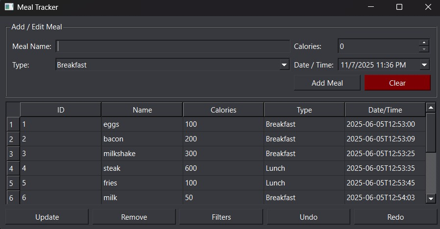

# Meal Tracker

**Meal Tracker** is a desktop application built in **C++** using **Qt Creator**, developed as part of an **Object-Oriented Programming (OOP)** course.

The app allows users to manage a collection of meals, view and filter them based on various criteria, and undo or redo recent actions.

---

## 🧩 Features

- **Repositories**
    - CSV-based repository for text-based persistence.
    - JSON-based repository for structured data storage.

- **Filtering (Strategy Pattern)**
    - Filter meals using **AND / OR** logical operations.
    - Filter by:
        - Type
        - Name
        - Calorie range  
          Implemented using the **Filter Strategy Pattern** for flexibility and modularity.

- **Undo / Redo (Command Pattern)**
    - Actions such as add, delete, or update can be undone and redone.
    - Implemented using the **Command Strategy Pattern** for clean, reversible operations.

---

## ⚙️ Technologies Used

- **Language:** C++
- **Framework:** Qt 6 / Qt Creator
- **Data formats:** CSV, JSON
- **Design Patterns:** Strategy Pattern, Command Pattern

---

## 🖼️ Application Preview

```markdown

```
